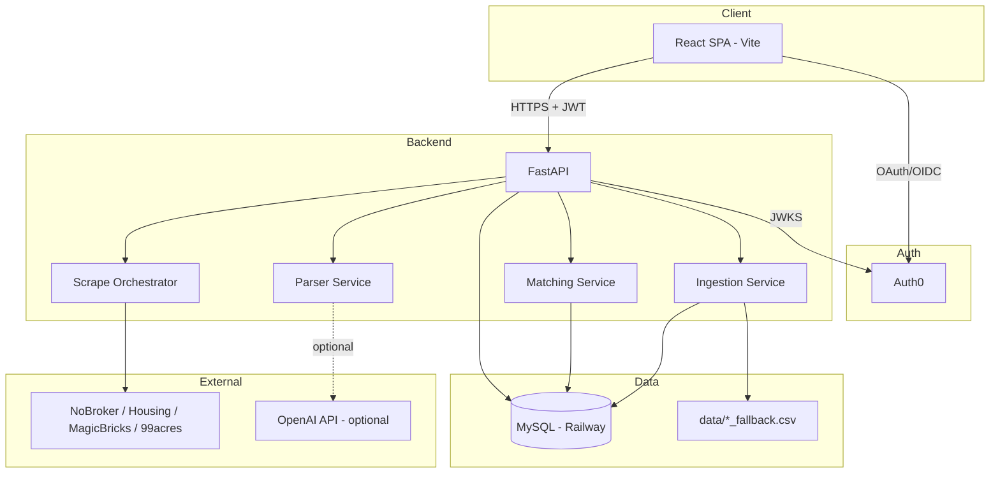
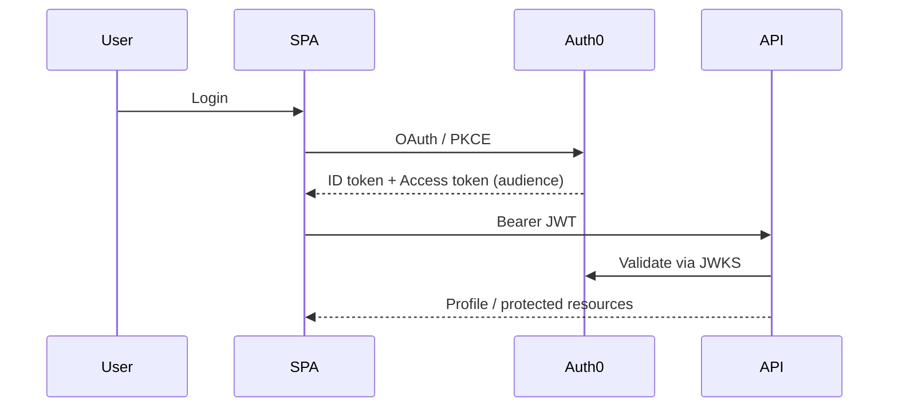
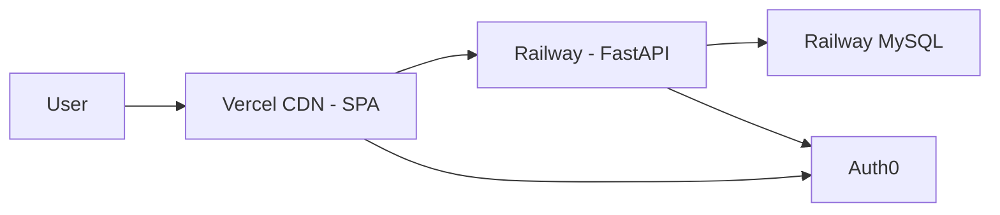

# Product / Technical Architecture Document

**Project:** Realist — Property Intelligence Dashboard  
**Team:** Group 10 | May 2026

> **Scope:** Architecture reflects implemented routers, `src/api/client.ts`, and UI routes only.

---

## 1. System Context

Realist is a browser-based SaaS-style dashboard for Indian residential property discovery. Authenticated users search in natural language, browse a unified listing catalog, shortlist favorites, compare up to four properties, and submit contact inquiries. Operators can seed or extend data via CSV upload and optional live scraping.



---

## 2. Frontend Architecture

### 2.1 Stack

| Layer | Technology |
|-------|------------|
| Framework | React 19 + TypeScript |
| Build | Vite 8 |
| Routing | React Router 7 |
| Styling | Tailwind CSS v4, design tokens in `index.css` |
| UI primitives | Custom components (shadcn-inspired patterns) |
| Charts | Recharts |
| Motion | Framer Motion |
| Auth | `@auth0/auth0-react` |

### 2.2 Application Structure

```
src/
├── App.tsx                 # Routes + Auth0 loading gate
├── main.tsx                # Root + providers
├── api/client.ts           # REST client
├── config.ts               # Env-based API + Auth0 config
├── context/
│   ├── PropertyContext.tsx # Catalog, favorites, parsed requirement
│   └── CompareContext.tsx  # Compare queue (localStorage)
├── pages/                  # Route screens
├── components/
│   ├── layout/             # AppShell, PageHeader, BrandLogo
│   ├── search/             # AISearchSection
│   ├── properties/         # Cards, grid, filters, modals
│   ├── compare/            # Table + charts
│   └── dashboard/          # Stats, trends (client-computed)
└── lib/                    # Mappers, filters, compare logic
```

### 2.3 Routing

| Route | Protection | Purpose |
|-------|------------|---------|
| `/` | Public | Marketing home + login |
| `/dashboard` | Auth | AI search, featured listings, client-computed analytics widgets (no analytics API) |
| `/properties` | Auth | Full catalog + server/local filters |
| `/properties/:id` | Auth | Detail view |
| `/saved` | Auth | Favorites / shortlist |
| `/compare` | Auth | Side-by-side comparison |
| `/upload` | Auth | CSV upload + live scrape |

### 2.4 State Management

- **Server state:** Fetched per page via `api/client.ts`; no global React Query (lightweight `useEffect` + context).
- **PropertyContext:** Shared catalog, favorites set, parsed requirement for dashboard.
- **CompareContext:** Persists selected properties in `localStorage` (`realestate-compare-list`).
- **Dark mode:** Toggle in `AppShell` only (adds `.dark` on `<html>`); not persisted; no `ThemeContext`.
- **Resilience:** `mergeProperties()` supplements API results with `mockProperties.ts` when fetch fails.
- **Frontend API surface:** Only the 15 functions in `src/api/client.ts` (no calls to `/health`, `/data/ingest`, or `/data/scrape/sources`).

### 2.5 Design System

Four-color palette (documented in `index.css`):

- Navy `#11224E` — structure/text  
- Orange `#F87B1B` — primary CTAs  
- Gray `#EEEEEE` — surfaces  
- Blue `#003865` family — accent/highlight  

Unified desktop header bar aligns sidebar brand and navbar underline.

---

## 3. Backend Architecture

### 3.1 Stack

| Layer | Technology |
|-------|------------|
| API | FastAPI 0.115 |
| Server | Uvicorn |
| ORM | SQLAlchemy 2.x |
| Migrations | Alembic |
| Database | MySQL (PyMySQL driver) |
| Auth | python-jose + Auth0 JWKS |
| HTTP / scrape | httpx, BeautifulSoup4, Playwright |
| Validation | Pydantic v2 |

### 3.2 Layered Layout

```
app/
├── main.py              # FastAPI app, CORS, router registration
├── config.py            # Settings from .env
├── database.py          # Engine, session, get_db
├── auth/                # JWT + ingest key
├── models/              # SQLAlchemy entities
├── schemas/             # Pydantic DTOs
├── routers/             # HTTP handlers
└── services/
    ├── parser.py
    ├── matching.py
    ├── ingestion.py
    ├── upload_parser.py
    └── scraping/
        ├── orchestrator.py
        ├── sites.py
        ├── compliance.py
        ├── parsers.py
        └── worker.py      # Playwright isolation for Housing
```

### 3.3 API Surface (Summary)

| Domain | Prefix | Notes |
|--------|--------|-------|
| Health | `/health` | Liveness |
| Profile | `/api/v1/me` | GET/PATCH, upsert user |
| Data | `/api/v1/data` | ingest, upload, scrape |
| Properties | `/api/v1/properties` | list, get, match |
| Requirements | `/api/v1/requirements` | parse, save, latest |
| Favorites | `/api/v1/favorites` | CRUD |
| Inquiries | `/api/v1/inquiries` | POST |

---

## 4. Database Architecture

### 4.1 Core Tables

| Table | Purpose | Key constraints |
|-------|---------|-----------------|
| `users` | Auth0-linked profile | Unique `auth0_sub` |
| `properties` | Normalized listings | Unique `(source, external_id)` |
| `requirements` | Saved NL searches | FK → `users` |
| `favorites` | User shortlist | Unique `(user_id, listing_key)` |
| `inquiries` | Contact submissions | FK → `users`, optional `property_id` |

### 4.2 Property Model (Conceptual)

Listings store title, address, city, state, price (INR), bedrooms, bathrooms, sqft, `property_type`, `listing_status` (`for_sale` / `for_rent`), `source`, `source_url`, optional lat/long.

### 4.3 Data Flow into MySQL

1. **Admin ingest** — `POST /data/ingest` reads `data/*_fallback.csv` (backend/curl only; no frontend page)  
2. **User upload** — `POST /data/upload` (CSV/XLSX, max 10 MB) from `/upload`  
3. **Live scrape** — `POST /data/scrape` from `/upload` (portal list hardcoded in UI; sources API exists but unused)  

All paths use `IngestionService._bulk_upsert` for idempotent writes.

---

## 5. Authentication Architecture



- SPA requests API **audience** (`VITE_AUTH0_AUDIENCE` = `AUTH0_API_AUDIENCE`).
- Backend `get_or_create_user` links `auth0_sub` to `users` row on first protected call.
- Public endpoints: health, property list (optional), requirement parse, match (optional JWT).

---

## 6. AI / Agent Usage (Technical)

| Capability | Implementation | AI? |
|------------|----------------|-----|
| NL parsing | `ParserService` — regex, city/locality dictionaries, budget normalization | Optional OpenAI via `OPENAI_API_KEY` |
| Property matching | `MatchingService` — weighted filters + scoring + reason strings | No LLM required |
| UI labels | “AI Property Search” | Marketing; core parse is rules-based |

Matching considers intent (buy/rent), bedrooms (exact BHK), city/locality, budget range, property type aliases, up to 300 candidates.

---

## 7. Scraping Architecture (Compliance-First)

| Source | Mechanism |
|--------|-----------|
| `nobroker` | JSON API via httpx |
| `magicbricks` | HTML + BeautifulSoup |
| `housing` | Playwright in isolated thread/worker |
| `99acres` | HTML (often blocked by robots.txt) |

`ComplianceGuard` checks `robots.txt` and enforces delay (`SCRAPE_DELAY_SECONDS`). Orchestrator aggregates per-source results and ingests rows.

---

## 8. Deployment Architecture



| Component | Platform | Notes |
|-----------|----------|-------|
| Frontend | Vercel | `vercel.json` SPA rewrites; build `dist` |
| Backend | Railway | `railway.toml`: migrate + uvicorn on `$PORT` |
| Database | Railway MySQL | `DATABASE_URL` injected |
| Auth | Auth0 cloud | SPA + API identifiers |

**CORS:** `CORS_ORIGINS` must include Vercel production URL.

**Scraping on Railway:** Playwright/Chromium may need extra setup; NoBroker/MagicBricks are HTTP-only and more deploy-friendly. `SCRAPE_ENABLED=false` disables scrape when browsers unavailable.

---

## 9. Security Highlights

- JWT validation on protected routes  
- Ingest endpoint protected by `INGEST_API_KEY`  
- CORS allowlist (not `*`) with credentials  
- File upload size cap (10 MB)  
- Scrape rate limiting + robots.txt respect  
- No secrets in frontend repo (Vite `VITE_*` only for public SPA config)

---

## 10. Key Non-Functional Characteristics

| Attribute | Approach |
|-----------|----------|
| Performance | Paginated property list; match candidate cap 300 |
| Availability | Frontend mock fallback if API down |
| Maintainability | Shared `PROPERTY_GRID_CLASS`, typed API client |
| Observability | `/health`, structured scrape errors per source |

---

## 11. Submission Documents (`docs/`)

| Deliverable | File |
|-------------|------|
| Groomed Requirements Document | `GROOMED_REQUIREMENTS.md` |
| Solution Plan / Implementation Plan | `SOLUTION_IMPLEMENTATION_PLAN.md` |
| Product / Technical Architecture Document | `PRODUCT_TECHNICAL_ARCHITECTURE.md` (this file) |
| Test Plan and Test Cases | `TEST_PLAN_AND_TEST_CASES.md` |
| Detailed Critical Review | `DETAILED_CRITICAL_REVIEW.md` |
| Agentic Coding Evidence | `AGENTIC_CODING_EVIDENCE.md` |
| Source Code and Deployment Details | `SOURCE_CODE_AND_DEPLOYMENT.md` |
