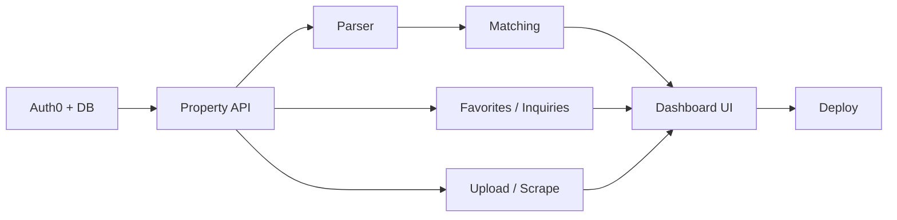

# Solution Plan / Implementation Plan

**Project:** Realist — Real Estate Property Intelligence Platform  
**Team:** TalentServ AI Hackathon — Group 10  
**Version:** 1.0 | May 2026

> **Scope:** Describes only what is implemented in the Group 10 frontend and backend repositories.

---

## 1. Problem and Solution Overview

Users describe property needs in natural language (e.g. “2 BHK in Baner under 50 lakh”). The solution parses that text, ranks listings from a normalized catalog, and supports browse, shortlist, compare, contact, and data ingestion through a modern web dashboard.

The implementation is split into two repositories:

| Repository | Role |
|------------|------|
| `talentserv-ai-hackathon-group-10-ui` | React SPA (Realist UI) |
| `talentserv-ai-hackathon-group-10-backend` | FastAPI API, MySQL, scraping, matching |

---

## 2. Approach Summary

1. **Foundation** — Auth0 login, user profile sync, MySQL schema, health checks, CORS.
2. **Data layer** — CSV fallback ingest, authenticated file upload, optional live scraping from Indian portals.
3. **Intelligence** — Rules-based NL parser (optional OpenAI), weighted property matching with explainable scores.
4. **User features** — Dashboard AI search, property browse/filter, detail, favorites, compare, inquiries.
5. **Polish** — Enterprise UI (AppShell, design tokens), responsive layout, offline mock fallback, deployment to Vercel + Railway.

---

## 3. Implementation Phases and Sequence

| Phase | Focus | Backend | Frontend | Status |
|-------|--------|---------|----------|--------|
| **0** | Auth & core API | JWT, `/me`, Alembic migrations | Auth0 provider, `ProtectedRoute`, home redirect | Done |
| **1** | Property catalog | `GET /properties`, ingest CSV | Properties page, grid, filters, pagination | Done |
| **2** | NL requirements | `POST /requirements/parse`, save/latest | `AISearchSection`, parsed state in `PropertyContext` (no `ParsedFiltersPanel` in UI) | Done |
| **3** | Matching | `POST /properties/match` | Matching results on dashboard, badges, scores | Done |
| **4** | Engagement | Favorites, inquiries | Shortlist, contact modal, compare (2–4 items) | Done |
| **5** | Data ops | Upload CSV/XLSX, live scrape; admin ingest (API only) | `/upload` page only — no ingest UI | Done |
| **6** | UX & deploy | CORS, Railway start command | Vercel SPA, design system, 3-col grid | Done |

Phases were built incrementally so each API could be tested with curl before wiring the UI.

---

## 4. Key Modules

### 4.1 Backend (`app/`)

| Module | Path | Responsibility |
|--------|------|----------------|
| **Config** | `app/config.py` | Environment: DB, Auth0, CORS, scrape flags |
| **Auth** | `app/auth/` | JWT validation, user upsert, ingest API key |
| **Models** | `app/models/` | SQLAlchemy: User, Property, Requirement, Favorite, Inquiry |
| **Schemas** | `app/schemas/` | Pydantic request/response DTOs |
| **Parser** | `app/services/parser.py` | NL → intent, BHK, budget, city, locality, type |
| **Matching** | `app/services/matching.py` | Candidate query + weighted scoring + reasons |
| **Ingestion** | `app/services/ingestion.py` | CSV glob ingest + upload upsert on `(source, external_id)` |
| **Scraping** | `app/services/scraping/` | Compliance guard, per-site scrapers, Playwright worker |
| **Upload parser** | `app/services/upload_parser.py` | CSV/XLSX row parsing |
| **Routers** | `app/routers/` | REST endpoints per domain |

### 4.2 Frontend (`src/`)

| Module | Path | Responsibility |
|--------|------|----------------|
| **API client** | `src/api/client.ts` | All backend calls, types |
| **Contexts** | `src/context/` | Property catalog + favorites; compare list (localStorage) |
| **Layout** | `src/components/layout/` | AppShell, sidebar, header, PageHeader, Section |
| **Search** | `src/components/search/` | AI search pill UI |
| **Properties** | `src/components/properties/` | Cards, grid, filters, inquiry modal |
| **Compare** | `src/components/compare/` | Table + Recharts |
| **Pages** | `src/pages/` | Route-level composition |
| **Lib** | `src/lib/` | Mappers, filters, compare metrics, price index (client) |
| **Mock data** | `src/data/mockProperties.ts` | Offline/demo fallback (24 listings) |

---

## 5. Group Responsibilities (Suggested Split)

| Area | Typical ownership | Deliverables |
|------|-------------------|--------------|
| **Backend API & DB** | Backend dev | FastAPI routes, Alembic, matching, parser |
| **Scraping & data** | Backend / full-stack | `scraping/`, ingest, upload, compliance |
| **Frontend UI/UX** | Frontend dev | AppShell, pages, PropertyCard, design tokens |
| **Auth & integration** | Full-stack | Auth0 SPA + API audience, `client.ts`, CORS |
| **Testing & docs** | Shared | pytest, manual test matrix, hackathon docs |
| **Deployment** | DevOps / full-stack | Railway, Vercel, env configuration |

*Adjust names to match your team’s actual assignments.*

---

## 6. Critical Design Decisions

| Decision | Rationale |
|----------|-----------|
| Rules parser first, LLM optional | Predictable demos; `OPENAI_API_KEY` enhances when available |
| Upsert on `(source, external_id)` | Deduplication across ingest, upload, and scrape |
| Compare in localStorage | Fast UX without extra API; max 4 properties |
| Mock catalog merge on API failure | Dashboard usable in hackathon demos without DB |
| Scrape as optional | Portals block bots; CSV upload is reliable fallback |
| Auth0 for identity | Challenge requirement; JWT for protected routes |
| Max 3 cards per row | Readable grid on large screens |

---

## 7. Dependencies Between Workstreams

---

## 8. Out of Scope (Not in Code)

- Payment / booking workflows  
- Seller listing management portal  
- Server-synced compare list  
- Global search / notification center  
- Outbound email for inquiries (stored in DB only)  
- Guaranteed scrape success on all portals  
- Native mobile apps  
- Frontend automated test suite  

---

## 9. Submission Documents (`docs/` only)

| Deliverable | File |
|-------------|------|
| Groomed Requirements Document | `docs/GROOMED_REQUIREMENTS.md` |
| Solution Plan / Implementation Plan | `docs/SOLUTION_IMPLEMENTATION_PLAN.md` (this file) |
| Product / Technical Architecture Document | `docs/PRODUCT_TECHNICAL_ARCHITECTURE.md` |
| Test Plan and Test Cases | `docs/TEST_PLAN_AND_TEST_CASES.md` |
| Detailed Critical Review | `docs/DETAILED_CRITICAL_REVIEW.md` |
| Agentic Coding Evidence | `docs/AGENTIC_CODING_EVIDENCE.md` |
| Source Code and Deployment Details | `docs/SOURCE_CODE_AND_DEPLOYMENT.md` |
